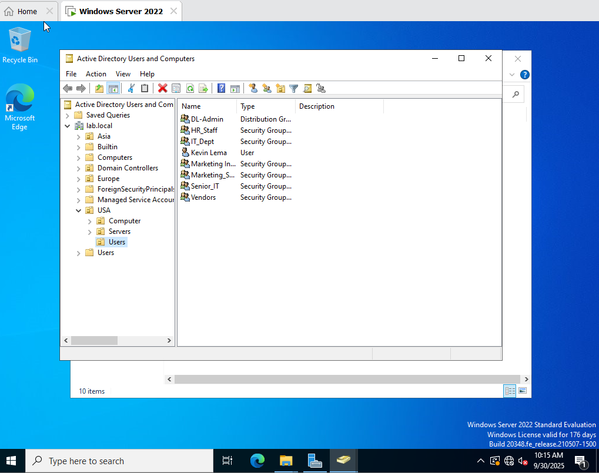
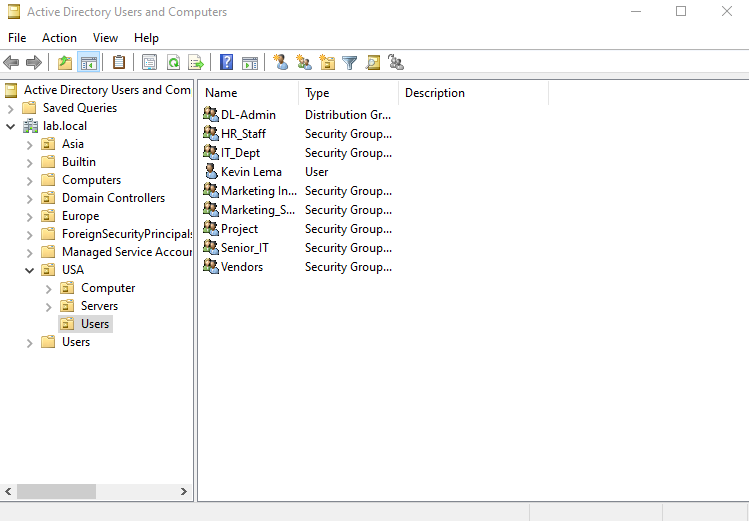
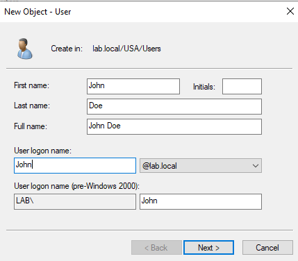
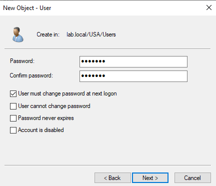
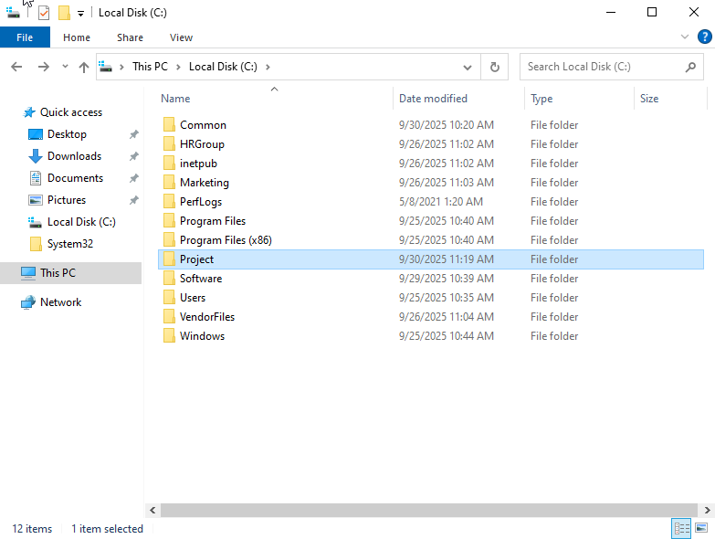
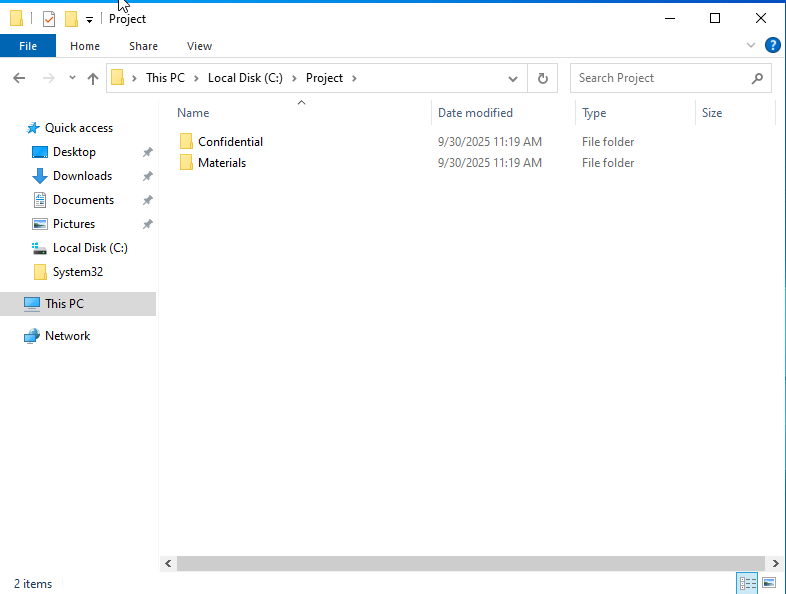
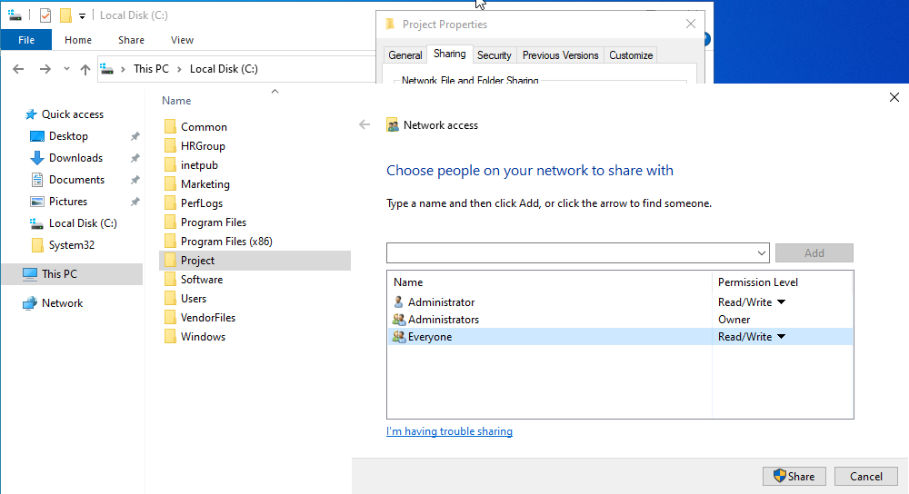
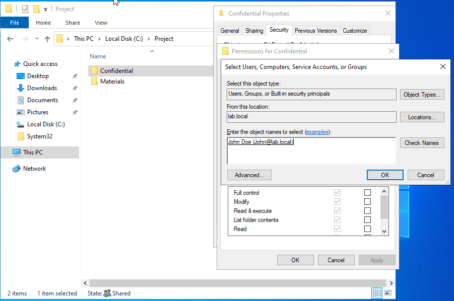
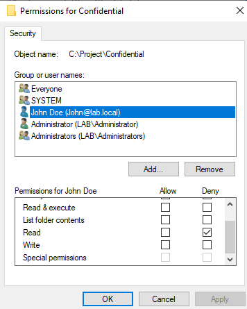

# Advanced File Sharing Lab - Effective Permissions/Inheritance and Explicit Deny

## Implementing Effective Permissions and Inheritance
### Scenario:
Everyone has full control over "Common" Folder and Subfolders("Project" and "Events") inherited full control as well. The Project Group needs access to only "Project" Folder

### 1. Create Folder and Subfolders

1. Navigate to "Active Directory User and Computers" -> Domain\User

2. Create Project Folder
[Implement Effective Permissions](../docs/screenshots/advanced-lab-group-access-2.png)

3. Navigate to Local Disk (C:) 
4. Create Common Folder
[Implement Effective Permissions](../docs/screenshots/advanced-lab-group-access-3.png)

5. Create Subfolders Project and Events
[Implement Effective Permissions](../docs/screenshots/advanced-lab-group-access-4.png)

### 2. Set Share and NTFS Permissions

1. In Common Folder -> Sharing tab,  Add "Everyone" -> Set Full Control
[Implement Effective Permissions](../docs/screenshots/advanced-lab-group-access-5.png)

2. In Common Folder -> Secrurity tab(NTFS), Add "Everyone" -> Set Full Control
[Implement Effective Permissions](../docs/screenshots/advanced-lab-group-access-6.png)

3. SubFolders have inherited same Share and NTFS Permissions from the parent(Common) Folder

### 3. Change NTFS Permissions for Project Subfolder
1. Convert Inheritance for Project Subfolder
[Implement Effective Permissions](../docs/screenshots/advanced-lab-group-access-7.png)

2. Remove "Everyone" from Permission Entries
[Implement Effective Permissions](../docs/screenshots/advanced-lab-group-access-8.png)

3. In NTFS Permissions, add Project Group -> Full Control
[Implement Effective Permissions](../docs/screenshots/advanced-lab-group-access-9.png)
[Implement Effective Permissions](../docs/screenshots/advanced-lab-group-access-10.png)

### 4. Result
[Implement Effective Permissions](../docs/screenshots/advanced-lab-group-access-11.png)

## Implementing Explicit Deny in NTFS Permissions
### Scenario:
As an IT administrator at a company where all employees have access to a shared "Project" folder, however the "Confidential Subfolder should not be accessed by John, a member of the employee group. All employees have Read & Write access to "Project" Folder, but John should be denied access to the Confidential subfolder

### 1. Create Folder and Subfolders
1. Navigate to "Active Directory User and Computers" -> Domain\User

2. Create User "John"

3. Navigate to Local Disk (C:) 
4. Create Project Folder

5. Create Subfolders Confidential and Materials

### 2. Set Share and NTFS Permissions

1. In Project Folder -> Sharing tab -> Share,  Add "Everyone" -> Set Read/Write Permissions

2. SubFolders have inherited same Share and NTFS Permissions from the parent(Project) Folder

### 3. Explcit Deny on Subfolder

1. In Confidential Subfolder -> Security tab Add "John -> Deny Read access

