# File Sharing Lab with Workplace Scenarios on Windows Server VM

## Granting Read-Only Access to a Shared Folder
### Scenario:
A Marketing Intern needs access to the Marketing Team’s shared folder
(\Server Name\Marketing) to view content but should not modify or delete files.

### 1. Modify Share Permissions

1. in File Explorer, Right-click Marketing Folder -> Properties -> Sharing tab -> Advanced Sharing

2. Set Share Permissions:
    - MarketingTeam -> Full Control
    

    - MarketingInterns -> Read
    

### 2. Modify NTFS Permissions

1. Properties -> Security tab -> Edit

2. Add MarketingInterns -> Set only Read permissions

### 3. Test Access

1. Log in as a Marketing Intern and try to open a file (It Should work)
2. Try to edit or delete a file (Should be denied)

## Creating a Private Department Folder
### Scenario:
The HR Department needs a secure folder (\Server\HR) that only HR staff can
access. Other employees should not see the folder at all.

### 1. Modify Share Permissions
1. Remove Everyone
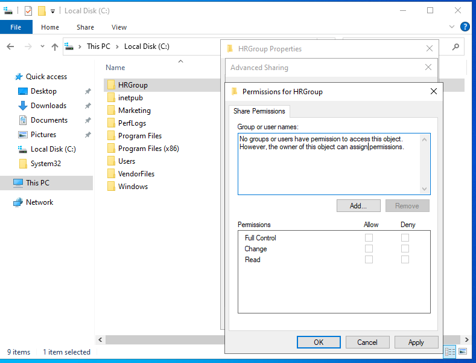
2. Add HRGroup -> Set Full Control
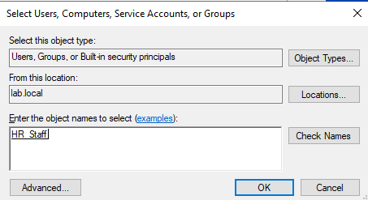
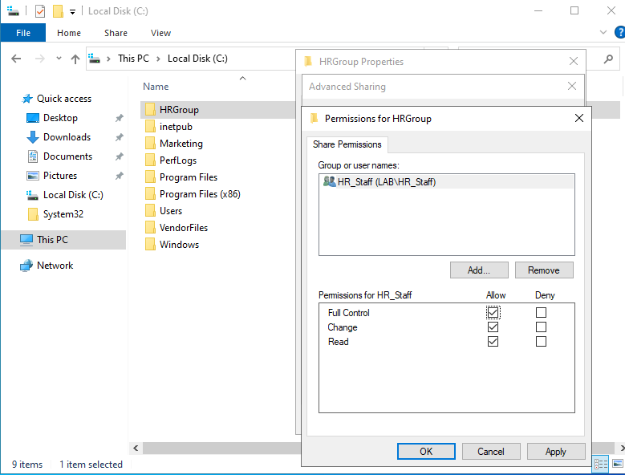

### 2. Modify NTFS Permissions

1. Add HRGroup -> Set Full Control
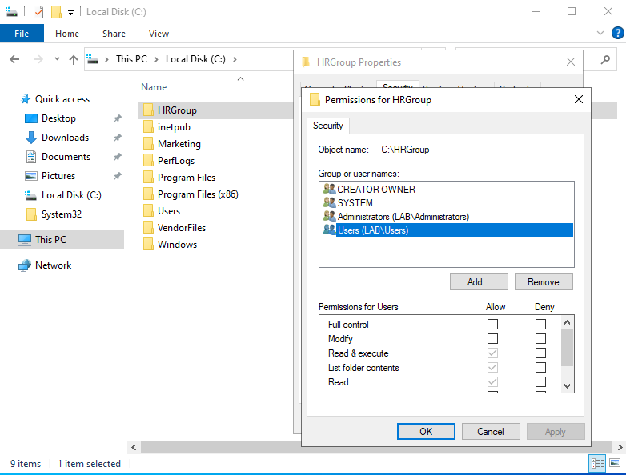
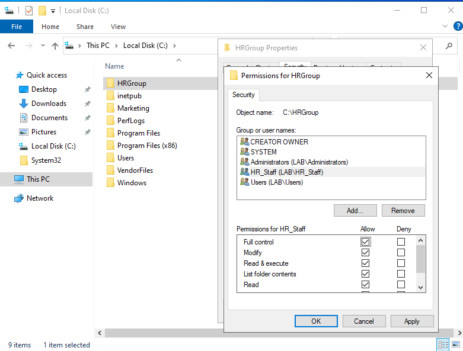

### 3. Test Access

1. Log in as an HR employee and open the folder (It Should Work)
2. Log in as a non-HR employee and try to access \\Server\HR (It Should Be Denied)

## Temporary File Access for a Vendor
### Scenario:
A third-party vendor needs access to a temporary folder (\Server\VendorFiles) to
upload reports but should not see other files.

### 1. Create a VendorFiles Folder
1. C:\Shared\VendorFiles
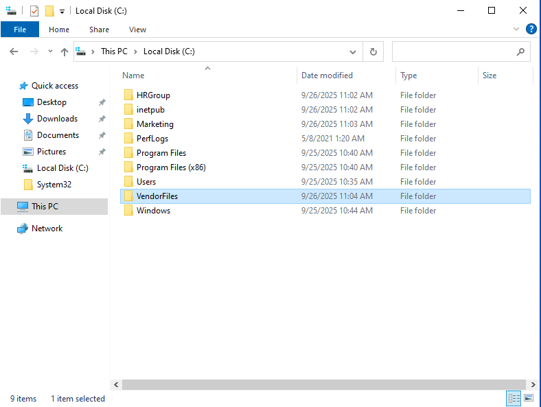

### 2. Set Share Permissions
1. Add VendorUser -> Set Full Control
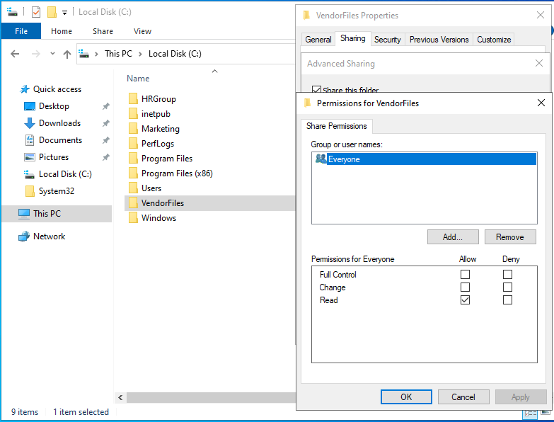
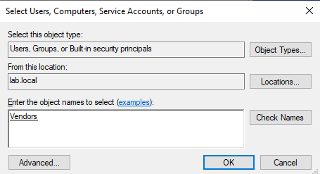
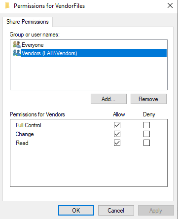

### 3. Set NTFS Permissions
1. Add VendorUser -> Set Modify (but Uncheck Delete)
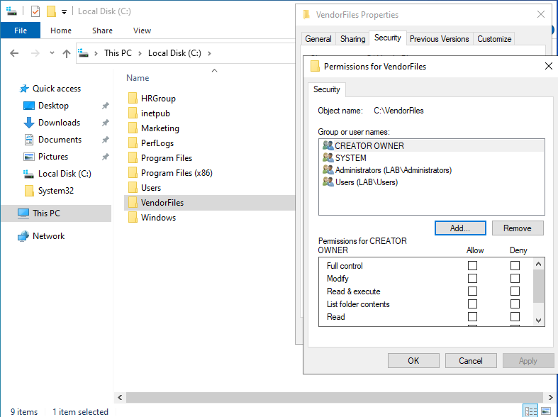
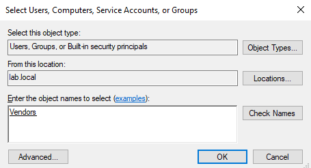
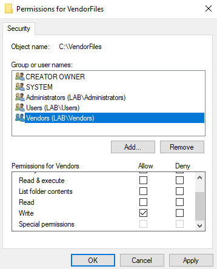

### 4. Test Access
1. Log in as VendorUser, upload a file (It Should Work)
2. Try deleting an existing file (Should be denied)

## Restricting Access to Specific Files Inside a Shared Folder
### Scenario:
In the IT Department, all techs need access to the Software Repository
(\Server\Software), but only senior IT staff should be able to access the "Licenses" subfolder.

### 1. Set Folder Permissions for \\Server\Software
1. ITStaff -> Modify (can add and edit files)
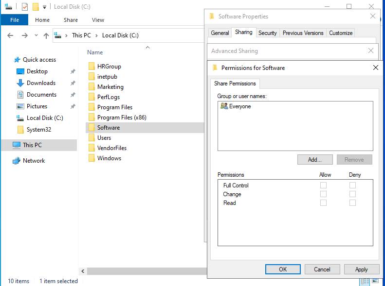
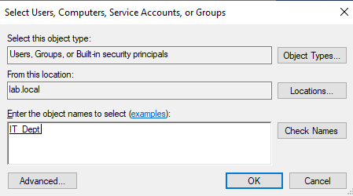
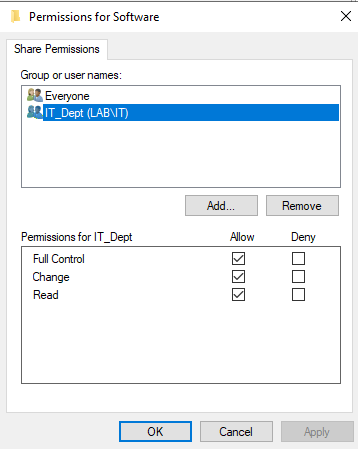

### 2. Set NTFS Permissions for \\Server\Software\Licenses
1. Remove inherited Permissions
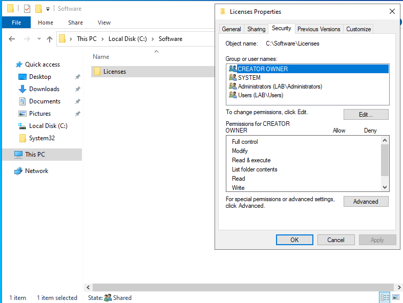
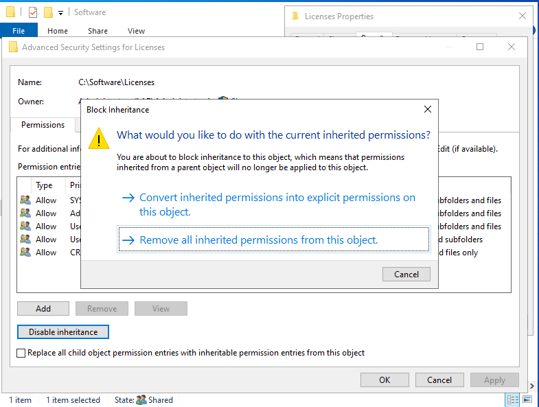

2. Add SeniorIT -> Full Control
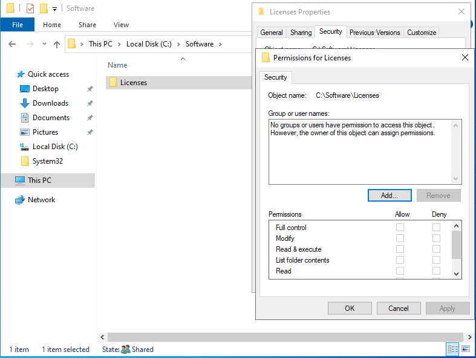
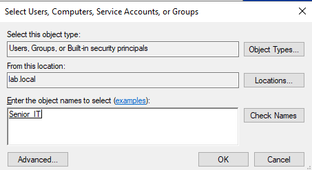
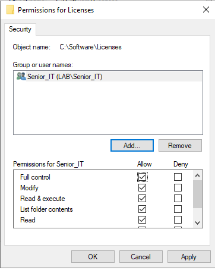

### 3. Test Access
1. Log in as a junior IT tech and open \\Server\Software (It Should Work)
2. Try accessing Licenses subfolder (Should be denied)
