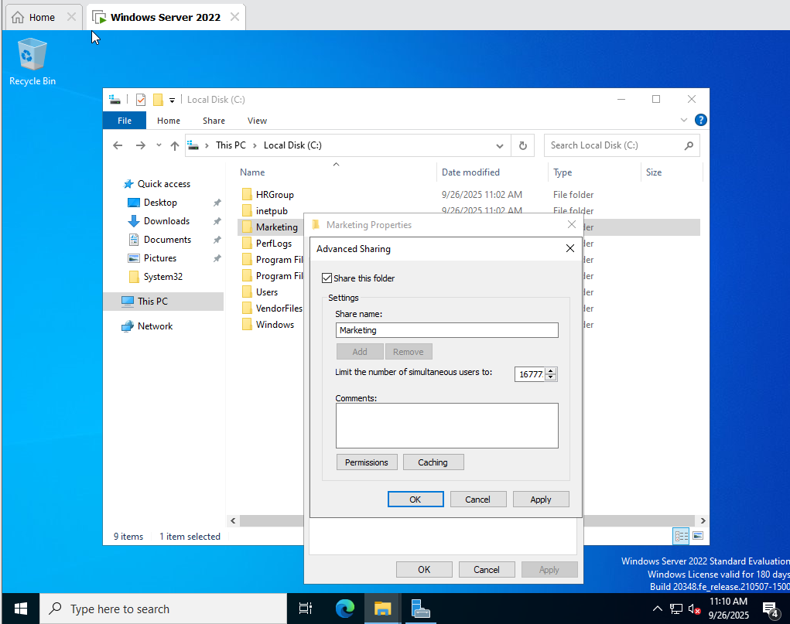
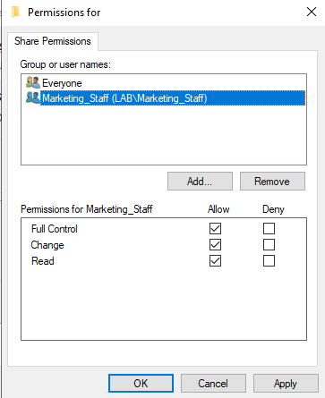
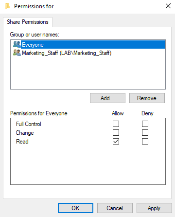
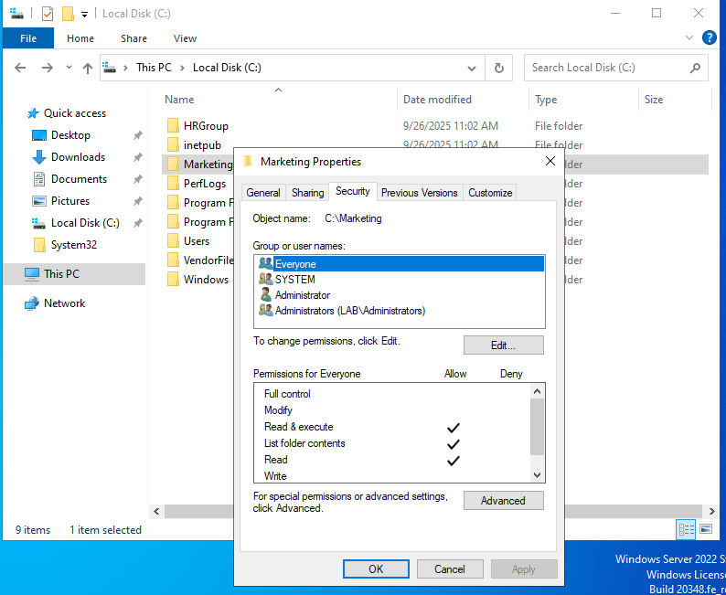
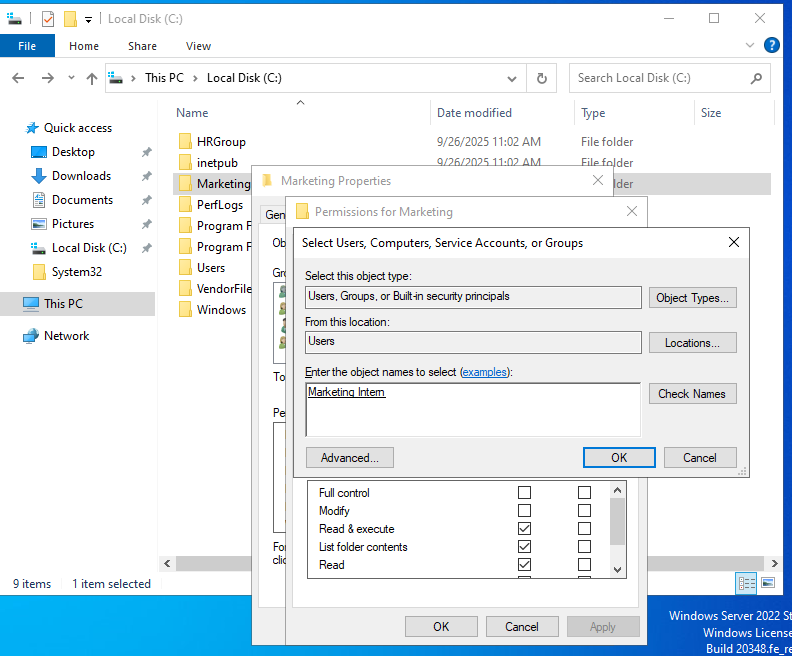
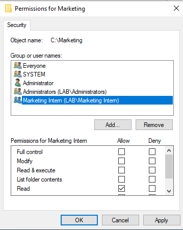

# File Sharing Lab with Workplace Scenarios on Windows Server VM

## Granting Read-Only Access to a Shared Folder
### Scenario:
A Marketing Intern needs access to the Marketing Team’s shared folder
(\Server Name\Marketing) to view content but should not modify or delete files.

### 1. Modify Share Permissions

1. in File Explorer, Right-click Marketing Folder -> Properties -> Sharing tab -> Advanced Sharing

2. Set Share Permissions:
    - MarketingTeam -> Full Control
    

    - MarketingInterns -> Read
    

### 2. Modify NTFS Permissions

1. Properties -> Security tab -> Edit

2. Add MarketingInterns -> Set only Read permissions

### 3. Test Access

1. Log in as a Marketing Intern and try to open a file (It Should work)

2. Try to edit or delete a file (Should be denied)

## Providing Write Access to a Project Folder
### Scenario:
A Project Manager requests that the Engineering Team be able to modify files in the \\Server\Projects folder but not delete any documents.

### 1. Modify Share Permissions

### 2. Modify NTFS Permissions

### 3. Test Access

## Creating a Private Department Folder
### Scenario:
The HR Department needs a secure folder (\Server\HR) that only HR staff can
access. Other employees should not see the folder at all.

### 1. Modify Share Permissions

### 2. Modify NTFS Permissions

### 3. Test Access

## Mapping a Drive for Finance Department
### Scenario:
The Finance Team regularly accesses files from \\Server\FinanceReports. Instead of typing the path every time, they request a mapped drive for quick access.

### 1. On a Finance Computer

### 2. Test Access

## Temporary File Access for a Vendor
### Scenario:
A third-party vendor needs access to a temporary folder (\Server\VendorFiles) to
upload reports but should not see other files.

### 1. Create a VendorFiles Folder

### 2. Set Share Permissions

### 3. Set NTFS Permissions

### 4. Test Access

## Restricting Access to Specific Files Inside a Shared Folder
### Scenario:
In the IT Department, all techs need access to the Software Repository
(\Server\Software), but only senior IT staff should be able to access the "Licenses" subfolder.

### 1. Modify Share Permissions

### 2. Modify NTFS Permissions

### 3. Test Access

